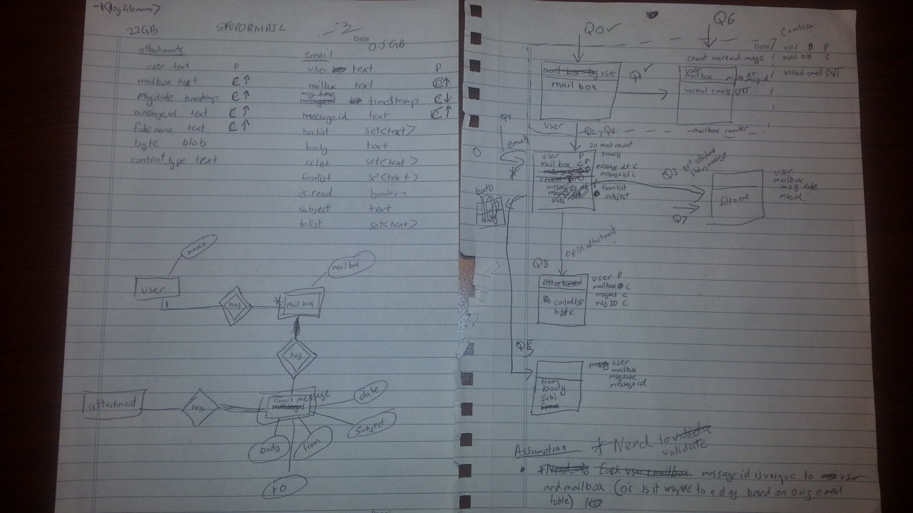

# Data Profiling

#### Team
<ol>
        <li> Hamdan Ahmad </li>
        <li> Dohar Silalahi </li>
        <li> Ravi Akkineni </li>
</ol>

## Plan of attack
The team started off analyzing the existing data model and profiling the data. We went through the existing ddl structure and ran sql queries to get sample result back to get a better understanding of the data. Using this knowledge we brainstormed on how the data model should look like

## Brain Storming


## Profiling

As part of this profiling effort we realized that there was some uncertainty on what the message_id field represented. We were unsure whehether message_id is a surrogate key representing a user, mailbox and msgdate. We tried answering this question using cql but ran into timeout issues before a result could be returned. Therefore turned to spark to answer this question for us.

Below query was used to determine whether message_id is unique to user, mailbox and msgdate.
```
val rdd = sc.cassandraTable("stupormail","email").select("user","mailbox","msgdate","message_id").as((user:String,mailbox:String,msgdate:String,message_id:String) => ((user,mailbox,msgdate),message_id)).countByKey.filter{case(k,v) => v > 1}.take(10)
```
The result result indicated that the message_id is not unique to a user, mailbox and msgdate. Meaning more than one messages could be tied to a user, mailbox and msgdate (perhaps a means to store things
```
gdate:String,message_id:String) => ((user,mailbox,msgdate),message_id)).countByKey.filter{case(k,v) => v > 1}.take(10)
rdd: scala.collection.Map[(String, String, String),Long] = Map((lokay-m,Discussion threads,2000-09-06 17:10:00+0000) -> 2, (john_griffith,All documents,2001-04-30 13:55:00+0000) -> 2, (lay-k,All documents,2001-03-12 09:00:00+0000) -> 3, (bass-e,All documents,2000-10-17 10:29:00+0000) -> 2, (arnold-j,'sent mail,2000-08-21 12:26:00+0000) -> 2, (dana_davis,Review,2001-08-13 14:54:32+0000) -> 2, (may-l,All documents,2000-11-01 17:08:00+0000) -> 3, (jones-t,Sent,2000-03-06 17:55:00+0000) -> 2, (dasovich-j,Mba program,1999-10-27 23:49:00+0000) -> 4, (haedicke-m,All documents,2000-02-01 12:00:00+0000) -> 4)
```
## Performance results before Changes (JMeter)

We benchmarked the performance of the current data model to compare against after we had tuned it

```
root@node0:~/disfigured# jmeter -n -t disfigured.jmx
Creating summariser <summary>
Created the tree successfully using disfigured.jmx
Starting the test @ Thu Nov 19 04:38:58 UTC 2015 (1447907938869)
Waiting for possible shutdown message on port 4445

0: Get mailboxes for a given user               1 in   0.1s =    6.8/s Avg:   148 Min:   148 Max:   148 Err:     0 (0.00%)
summary:                                 +      1 in   0.1s =    6.8/s Avg:   148 Min:   148 Max:   148 Err:     0 (0.00%) Active: 2 Started: 2 Finished: 0

0: Get mailboxes for a given user             320 in  29.1s =   11.0/s Avg:   116 Min:     1 Max:   280 Err:     0 (0.00%)
1: Get count of unread                        320 in    30s =   10.7/s Avg:    19 Min:     1 Max:   170 Err:     0 (0.00%)
2: Get 20 most recent in given mailbox        319 in    30s =   10.7/s Avg:    10 Min:     2 Max:   176 Err:     0 (0.00%)
3: Determine if msg has attachments         19908 in    30s =  665.5/s Avg:     8 Min:     1 Max:   180 Err:     0 (0.00%)
4: List the next 20 in the given mailbox      768 in    30s =   25.9/s Avg:    12 Min:     3 Max:    80 Err:     0 (0.00%)
5: Read one message with body                2968 in    30s =  100.2/s Avg:     9 Min:     1 Max:   119 Err:     0 (0.00%)
6: Mark message as read                      2968 in    30s =  100.2/s Avg:     8 Min:     1 Max:   175 Err:     0 (0.00%)
7: List the atts for the given message       2967 in    30s =  100.1/s Avg:     8 Min:     1 Max:   171 Err:     0 (0.00%)
8: Write email                               1973 in    30s =   65.9/s Avg:     8 Min:     0 Max:   439 Err:     0 (0.00%)
9: Delete the given message                   146 in    29s =    5.1/s Avg:     8 Min:     1 Max:    36 Err:     0 (0.00%)
summary:                                 +  32657 in    30s = 1090.0/s Avg:     9 Min:     0 Max:   439 Err:     0 (0.00%) Active: 22 Started: 22 Finished: 0
summary:                                 =  32658 in  30.1s = 1084.9/s Avg:     9 Min:     0 Max:   439 Err:     0 (0.00%)

0: Get mailboxes for a given user             412 in    30s =   13.7/s Avg:   178 Min:     7 Max:   422 Err:     0 (0.00%)
1: Get count of unread                        413 in    30s =   13.8/s Avg:    33 Min:     4 Max:   247 Err:     0 (0.00%)
2: Get 20 most recent in given mailbox        413 in    30s =   13.8/s Avg:    20 Min:     5 Max:   115 Err:     0 (0.00%)
3: Determine if msg has attachments         26217 in    30s =  873.3/s Avg:    19 Min:     1 Max:   174 Err:     0 (0.00%)
4: List the next 20 in the given mailbox     1017 in    30s =   33.9/s Avg:    26 Min:     5 Max:   179 Err:     0 (0.00%)
5: Read one message with body                3888 in    30s =  129.5/s Avg:    20 Min:     2 Max:   169 Err:     0 (0.00%)
6: Mark message as read                      3886 in    30s =  129.6/s Avg:    20 Min:     2 Max:   173 Err:     0 (0.00%)
7: List the atts for the given message       3884 in    30s =  129.4/s Avg:    19 Min:     2 Max:   178 Err:     0 (0.00%)
8: Write email                               1753 in    30s =   58.4/s Avg:    21 Min:     2 Max:   624 Err:     0 (0.00%)
9: Delete the given message                   188 in    30s =    6.3/s Avg:    20 Min:     3 Max:    65 Err:     0 (0.00%)
summary:                                 +  42071 in  30.1s = 1399.9/s Avg:    21 Min:     1 Max:   624 Err:     0 (0.00%) Active: 41 Started: 41 Finished: 0
summary:                                 =  74729 in  60.1s = 1243.7/s Avg:    16 Min:     0 Max:   624 Err:     0 (0.00%)

0: Get mailboxes for a given user             430 in  30.2s =   14.2/s Avg:   192 Min:     9 Max:   431 Err:     0 (0.00%)
1: Get count of unread                        430 in    30s =   14.3/s Avg:    43 Min:     8 Max:   228 Err:     0 (0.00%)
2: Get 20 most recent in given mailbox        430 in    30s =   14.4/s Avg:    26 Min:     6 Max:    89 Err:     0 (0.00%)
3: Determine if msg has attachments         27833 in  30.1s =  926.2/s Avg:    24 Min:     2 Max:   198 Err:     0 (0.00%)
4: List the next 20 in the given mailbox     1074 in    30s =   35.9/s Avg:    33 Min:    10 Max:   157 Err:     0 (0.00%)
5: Read one message with body                4156 in    30s =  138.6/s Avg:    25 Min:     3 Max:   158 Err:     0 (0.00%)
6: Mark message as read                      4155 in    30s =  138.5/s Avg:    25 Min:     4 Max:   155 Err:     0 (0.00%)
7: List the atts for the given message       4155 in    30s =  138.6/s Avg:    24 Min:     3 Max:   174 Err:     0 (0.00%)
8: Write email                               1620 in    30s =   54.0/s Avg:    26 Min:     5 Max:   541 Err:     0 (0.00%)
9: Delete the given message                   215 in    30s =    7.2/s Avg:    24 Min:     7 Max:    62 Err:     0 (0.00%)
summary:                                 +  44498 in  30.3s = 1468.1/s Avg:    26 Min:     2 Max:   541 Err:     0 (0.00%) Active: 41 Started: 41 Finished: 0
summary:                                 = 119227 in  90.1s = 1323.0/s Avg:    20 Min:     0 Max:   624 Err:     0 (0.00%)

0: Get mailboxes for a given user             428 in    30s =   14.2/s Avg:   189 Min:    10 Max:   455 Err:     0 (0.00%)
1: Get count of unread                        428 in    30s =   14.3/s Avg:    40 Min:     7 Max:   189 Err:     0 (0.00%)
2: Get 20 most recent in given mailbox        429 in    30s =   14.3/s Avg:    26 Min:     9 Max:   137 Err:     0 (0.00%)
3: Determine if msg has attachments         27941 in  30.1s =  929.4/s Avg:    24 Min:     2 Max:   168 Err:     0 (0.00%)
4: List the next 20 in the given mailbox     1087 in    30s =   36.2/s Avg:    34 Min:     9 Max:   134 Err:     0 (0.00%)
5: Read one message with body                4175 in    30s =  139.1/s Avg:    26 Min:     6 Max:   138 Err:     0 (0.00%)
6: Mark message as read                      4175 in    30s =  139.0/s Avg:    25 Min:     2 Max:   145 Err:     0 (0.00%)
7: List the atts for the given message       4173 in    30s =  138.9/s Avg:    25 Min:     4 Max:   165 Err:     0 (0.00%)
8: Write email                               1626 in  30.1s =   54.1/s Avg:    27 Min:     1 Max:   779 Err:     0 (0.00%)
9: Delete the given message                   207 in    30s =    7.0/s Avg:    24 Min:     4 Max:   139 Err:     0 (0.00%)
summary:                                 +  44669 in  30.2s = 1477.1/s Avg:    26 Min:     1 Max:   779 Err:     0 (0.00%) Active: 41 Started: 41 Finished: 0
summary:                                 = 163896 in   120s = 1364.8/s Avg:    21 Min:     0 Max:   779 Err:     0 (0.00%)
```

## Data Model

Here is the data model that was created. We started off with the goal of having one table per query. However we used up opportunities where the tables could be merged inorder to support more than one query with a signel table, this was done while keeping in mind the tradeoff between performance and maintainability of the data model.

The final solution ended up having 5 tables to support all queries.

Once of the key things we wanted to do (after reviewing the queries and the data) was to separate large fields that were queries by only a single from a table that other queries were using. Hence attachment and body got their own table.

```sql
DROP KEYSPACE supermail;

--Creating 5 tables
CREATE KEYSPACE supermail WITH replication = {'class': 'SimpleStrategy', 'replication_factor': '1'}  AND durable_writes = true;

-- Query0, Query1
-- Separate this table from supermail.message_read_by_user_mailbox After realizing that
-- cql does not support sum on cql at this time and therefore could not do this merge.
-- Instead we decided to go with a counter table knowing that there are cases where counters are known to cause inconsistency
-- in cases where a node goes down and replays the counter. We felt given our use case 100% consistency was not neccessary 
-- and decided to go with simplicity instead
CREATE TABLE supermail.unread_messages_by_user_mailbox (
    user text,
    mailbox text,
	unread_count counter,
    PRIMARY KEY ((user),mailbox)
);

--Query6
-- this table stores the email content at a high level (not  including body) keep it small and yet quick to query with
CREATE TABLE supermail.message_read_by_user_mailbox (
	user text,
	mailbox text,
	msgdate timestamp,
	message_id text,
	is_read boolean,
	PRIMARY KEY (user,mailbox,msgdate,message_id )
);

--Query 2,4
CREATE TABLE supermail.email_header_by_mailbox (
	user text,
	mailbox text,
	msgdate timestamp,
	message_id text,
	fromlist set<text>,
	subject text,
	PRIMARY KEY ((user,mailbox),msgdate, message_id)
) WITH CLUSTERING ORDER BY  (msgdate DESC,message_id ASC);

-- query 5 
-- We could potentially merge this tabke with email_header_by_mailbox if we needed to further enchance performance incase 
-- the table was too small.
CREATE TABLE supermail.email_content_by_mailbox (
	user text,
	mailbox text,
	msgdate timestamp,
	message_id text,
	--bcclist set<text>,
	body text,
	--cclist set<text>,
	fromlist set<text>,
	--is_read boolean,
	subject text,
	--tolist set<text>,
	PRIMARY KEY (user, mailbox, msgdate, message_id)
) WITH CLUSTERING ORDER BY (mailbox ASC, msgdate DESC, message_id ASC);

--Query 8
--The following two tables were created using the attachment table. The table below contains the the attachment itself as a --blob and the one below is the header. The separation allowed us to query the header column much faster and we expect in most cases this table would be queries more often than the other one
CREATE TABLE supermail.attachments_by_email (
	user text,
	mailbox text,
	msgdate timestamp,
	message_id text,
	filename text,
	bytes blob,
	content_type text,
	PRIMARY KEY (user, mailbox, msgdate,message_id,filename)
) ;

-- Query 3 and Query 7
CREATE TABLE supermail.attachment_header_by_email (
	user text,
	mailbox text,
	msgdate timestamp,
	message_id text,
	filename text,
	PRIMARY KEY ((user, mailbox, msgdate), message_id, filename)
) WITH CLUSTERING ORDER BY (message_id ASC,filename ASC);
```

## Load data
Below are the spark queries that were used to load the data model.
Note: we realize that the should have presisted the email and attachment rdds one and then reused them to load data into the the target table.

```sh
--Script to populate the data into the datamodel
--populating supermail.email_header_by_mailbox
val email = sc.cassandraTable("stupormail","email").select("user","mailbox","msgdate","message_id","fromlist","subject")
email.saveToCassandra("supermail","email_header_by_mailbox")

--populating supermail.email_content_by_mailbox  (there is a potential to merge with email_header_by_mailbox)
val email = sc.cassandraTable("stupormail","email").select("user","mailbox","msgdate","message_id","body","fromlist","subject")
email.saveToCassandra("supermail","email_content_by_mailbox")

--populating supermail.attachment_header_by_email  
val attachments = sc.cassandraTable("stupormail","attachments").select("user","mailbox","msgdate","message_id","filename")
attachments.saveToCassandra("supermail","attachment_header_by_email")

--populating supermail.attachments_by_email  
--Note: not populating the content column as per instructor
val attachments = sc.cassandraTable("stupormail","attachments").select("user","mailbox","msgdate","message_id","filename","content_type")
attachments.saveToCassandra("supermail","attachments_by_email",SomeColumns("user","mailbox","msgdate","message_id","filename","content_type"))

--populating supermail.attachments_by_email  
val email = sc.cassandraTable("stupormail","email").select("user","mailbox","msgdate","message_id","is_read")
email.saveToCassandra("supermail","message_read_by_user_mailbox")

--populating supermail.unread_messages_by_user_mailbox
val email = sc.cassandraTable("stupormail","email").select("user","mailbox","is_read").as((user:String,mailbox:String,is_read:Option[Boolean]) => ((user,mailbox),if (is_read.getOrElse(false)==true) 0 else 1)).reduceByKey(_ + _).map{case (k,v) => (k._1,k._2,v)}
email.take(10).foreach(println)
email.saveToCassandra("supermail","unread_messages_by_user_mailbox",SomeColumns("user","mailbox","unread_count"))
```

## Verify Data Load
Ensure that the data has been loaded
```sql
select * from supermail.unread_messages_by_user_mailbox limit 10;
select * from supermail.message_read_by_user_mailbox limit 10;
select * from supermail.email_header_by_mailbox limit 10;
select * from supermail.attachments_by_email limit 10;
select * from supermail.attachment_header_by_email limit 10;
```

## Performance Results After Changes (Jmeter)

We updated the Jmeter file to reflect the changes in the data mode. There was increase in the number of transactions we had to do an insert/delete operation since the number of tables had increased. But overall we saw roughly a gain of about a 100% in performance.

The updated disfigured_updated.jmx have been uploaded to the repo

Note: Error reported below were a results of bad data in the test files used.

```sh
root@node0:~/disfigured# jmeter -n -t disfigured_updated.jmx
Creating summariser <summary>
Created the tree successfully using disfigured_updated.jmx
Starting the test @ Thu Nov 19 04:45:28 UTC 2015 (1447908328703)
Waiting for possible shutdown message on port 4445

0: Get mailboxes for a given user               1 in   0.1s =   18.9/s Avg:    53 Min:    53 Max:    53 Err:     0 (0.00%)
1: Get count of unread                          1 in     0s =   27.8/s Avg:    36 Min:    36 Max:    36 Err:     0 (0.00%)
2: Get 20 most recent in given mailbox          1 in     0s =   34.5/s Avg:    29 Min:    29 Max:    29 Err:     0 (0.00%)
3: Determine if msg has attachments            20 in   0.1s =  219.8/s Avg:     4 Min:     2 Max:    18 Err:     0 (0.00%)
summary:                                 +     26 in   0.3s =   87.5/s Avg:     8 Min:     2 Max:    53 Err:     0 (0.00%) Active: 2 Started: 2 Finished: 0

0: Get mailboxes for a given user            2361 in    30s =   79.1/s Avg:     3 Min:     0 Max:    43 Err:     0 (0.00%)
1: Get count of unread                       2361 in    30s =   79.1/s Avg:     3 Min:     1 Max:    69 Err:     0 (0.00%)
2: Get 20 most recent in given mailbox       2360 in    30s =   79.1/s Avg:     3 Min:     1 Max:    67 Err:     0 (0.00%)
3: Determine if msg has attachments         34980 in    30s = 1172.4/s Avg:     2 Min:     0 Max:   153 Err:     0 (0.00%)
4: List the next 20 in the given mailbox     1481 in    30s =   49.6/s Avg:     3 Min:     1 Max:    61 Err:     0 (0.00%)
5: Read one message with body                5141 in    30s =  171.8/s Avg:     3 Min:     1 Max:    70 Err:     0 (0.00%)
7: List the atts for the given message       5139 in    30s =  171.9/s Avg:     2 Min:     0 Max:    68 Err:     0 (0.00%)
8: Open the given attachment                  402 in  27.2s =   14.8/s Avg:     3 Min:     0 Max:    42 Err:     0 (0.00%)
summary:                                 +  66757 in    30s = 2226.9/s Avg:     2 Min:     0 Max:   153 Err:   512 (0.77%) Active: 22 Started: 22 Finished: 0
summary:                                 =  66783 in  30.3s = 2204.9/s Avg:     2 Min:     0 Max:   153 Err:   512 (0.77%)

0: Get mailboxes for a given user            2976 in    30s =   99.2/s Avg:     3 Min:     1 Max:    65 Err:     0 (0.00%)
1: Get count of unread                       2975 in    30s =   99.2/s Avg:     4 Min:     0 Max:    83 Err:     0 (0.00%)
2: Get 20 most recent in given mailbox       2976 in    30s =   99.2/s Avg:     3 Min:     1 Max:    81 Err:     0 (0.00%)
3: Determine if msg has attachments         44191 in    30s = 1473.0/s Avg:     2 Min:     0 Max:    83 Err:     0 (0.00%)
4: List the next 20 in the given mailbox     1873 in    30s =   62.5/s Avg:     3 Min:     1 Max:    74 Err:     0 (0.00%)
5: Read one message with body                6464 in    30s =  215.6/s Avg:     3 Min:     0 Max:    75 Err:     0 (0.00%)
7: List the atts for the given message       6466 in    30s =  215.6/s Avg:     2 Min:     0 Max:    62 Err:     0 (0.00%)
8: Open the given attachment                  527 in    30s =   17.7/s Avg:     3 Min:     1 Max:    46 Err:     0 (0.00%)
summary:                                 +  83757 in    30s = 2791.8/s Avg:     2 Min:     0 Max:    83 Err:   636 (0.76%) Active: 41 Started: 41 Finished: 0
summary:                                 = 150540 in  60.3s = 2497.1/s Avg:     2 Min:     0 Max:   153 Err:  1148 (0.76%)

0: Get mailboxes for a given user            2948 in    30s =   98.3/s Avg:     3 Min:     0 Max:    71 Err:     0 (0.00%)
1: Get count of unread                       2949 in    30s =   98.3/s Avg:     4 Min:     0 Max:    85 Err:     0 (0.00%)
2: Get 20 most recent in given mailbox       2949 in    30s =   98.3/s Avg:     3 Min:     0 Max:    80 Err:     0 (0.00%)
3: Determine if msg has attachments         43762 in    30s = 1458.7/s Avg:     3 Min:     0 Max:    87 Err:     0 (0.00%)
4: List the next 20 in the given mailbox     1860 in    30s =   62.3/s Avg:     3 Min:     1 Max:    53 Err:     0 (0.00%)
5: Read one message with body                6465 in    30s =  215.6/s Avg:     3 Min:     1 Max:    82 Err:     0 (0.00%)
7: List the atts for the given message       6465 in    30s =  215.6/s Avg:     3 Min:     0 Max:    80 Err:     0 (0.00%)
8: Open the given attachment                  480 in  29.3s =   16.4/s Avg:     3 Min:     0 Max:    40 Err:     0 (0.00%)
summary:                                 +  83196 in    30s = 2772.6/s Avg:     3 Min:     0 Max:    89 Err:   652 (0.78%) Active: 41 Started: 41 Finished: 0
summary:                                 = 233736 in  90.3s = 2588.8/s Avg:     3 Min:     0 Max:   153 Err:  1800 (0.77%)

0: Get mailboxes for a given user            2968 in    30s =   99.0/s Avg:     3 Min:     0 Max:    30 Err:     0 (0.00%)
1: Get count of unread                       2968 in    30s =   99.0/s Avg:     4 Min:     0 Max:    82 Err:     0 (0.00%)
2: Get 20 most recent in given mailbox       2968 in    30s =   99.0/s Avg:     3 Min:     0 Max:    83 Err:     0 (0.00%)
3: Determine if msg has attachments         44057 in    30s = 1468.5/s Avg:     2 Min:     0 Max:    86 Err:     0 (0.00%)
4: List the next 20 in the given mailbox     1877 in    30s =   62.7/s Avg:     3 Min:     1 Max:    59 Err:     0 (0.00%)
5: Read one message with body                6491 in    30s =  216.4/s Avg:     3 Min:     1 Max:    87 Err:     0 (0.00%)
7: List the atts for the given message       6487 in    30s =  216.4/s Avg:     2 Min:     0 Max:    80 Err:     0 (0.00%)
8: Open the given attachment                  535 in    30s =   17.9/s Avg:     4 Min:     0 Max:    60 Err:     0 (0.00%)
summary:                                 +  83704 in    30s = 2790.0/s Avg:     3 Min:     0 Max:    87 Err:   632 (0.76%) Active: 41 Started: 41 Finished: 0
summary:                                 = 317440 in   120s = 2639.0/s Avg:     3 Min:     0 Max:   153 Err:  2432 (0.77%)

0: Get mailboxes for a given user            2954 in    30s =   98.6/s Avg:     3 Min:     0 Max:    88 Err:     0 (0.00%)
1: Get count of unread                       2954 in    30s =   98.6/s Avg:     4 Min:     0 Max:    53 Err:     0 (0.00%)
2: Get 20 most recent in given mailbox       2954 in    30s =   98.6/s Avg:     3 Min:     1 Max:    59 Err:     0 (0.00%)
3: Determine if msg has attachments         43838 in    30s = 1461.5/s Avg:     3 Min:     0 Max:    87 Err:     0 (0.00%)
4: List the next 20 in the given mailbox     1864 in    30s =   62.1/s Avg:     3 Min:     1 Max:    66 Err:     0 (0.00%)
5: Read one message with body                6413 in    30s =  213.9/s Avg:     3 Min:     1 Max:    59 Err:     0 (0.00%)
7: List the atts for the given message       6417 in    30s =  213.9/s Avg:     3 Min:     0 Max:    83 Err:     0 (0.00%)
8: Open the given attachment                  527 in  29.4s =   17.9/s Avg:     4 Min:     1 Max:    57 Err:     0 (0.00%)
summary:                                 +  83133 in    30s = 2771.0/s Avg:     3 Min:     0 Max:    88 Err:   644 (0.77%) Active: 41 Started: 41 Finished: 0
summary:                                 = 400573 in   150s = 2665.4/s Avg:     3 Min:     0 Max:   153 Err:  3076 (0.77%)

```


